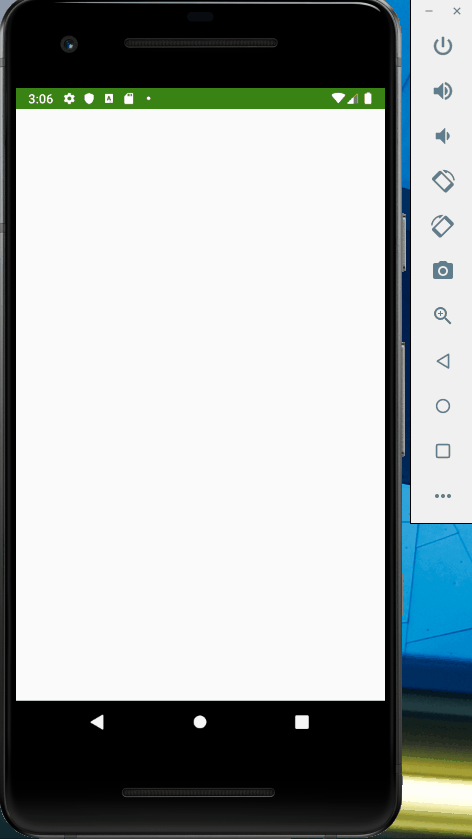

# SleepTrackerRV

An Android application that uses a RecyclerView to track and display the user's sleep quality.

Submitted by: Tanner Iverson

Time spent: 6 hours

## User Stories

The following **required** functionality is complete:

* [X] Change LinearLayout to GridLayout.
* [X] Implement Click Listener SleepNight icons.
* [X] Add navigation to detail screen when SleepNight icon is clicked.
* [X] Add list header.
* [X] Modify header to span and display properly on a GridLayout.

The following **additional** features are implemented:

* [X] List anything else that you can get done to improve the app functionality!

## Previous implemented functionality:

* [X] Refactor onBindViewHolder
* [X] Refactor onCreateViewHolder
* [X] Refresh sleep night data using DiffUtil
* [X] Add data binding to the adapter.
* [X] Add binding adapters.

* [X] Replace ScrollView with RecyclerView.
* [X] Create RecyclerView adapter and ViewHolder for data binding.
* [X] Display sleep quality list by using recycled ViewHolders.
* [X] Display sleep quality list using icons instead of text.

## Video Walkthrough

Here's a walkthrough of implemented user stories:

## Notes

Possible additional features: 
delete just one sleep quality entry by swiping off screen, 
include more details such as the user's sleep statistics

## License

Copyright 2019 Tanner Iverson

Licensed under the Apache License, Version 2.0 (the "License");
you may not use this file except in compliance with the License.
You may obtain a copy of the License at

http://www.apache.org/licenses/LICENSE-2.0

Unless required by applicable law or agreed to in writing, software
distributed under the License is distributed on an "AS IS" BASIS,
WITHOUT WARRANTIES OR CONDITIONS OF ANY KIND, either express or implied.
See the License for the specific language governing permissions and
limitations under the License.
